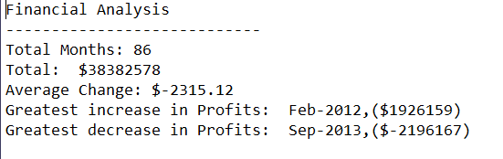
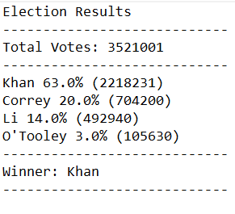

<<<<<<< HEAD
# Py Me Up, Charlie

## PyBank

* In this challenge, I was tasked with creating a Python script for analyzing the financial records of your company. I was given a set of financial data called [budget_data.csv](PyBank/Resources/budget_data.csv). The dataset is composed of two columns: `Date` and `Profit/Losses`. (Thankfully, my company has rather lax standards for accounting so the records are simple.)

* The task is to create a Python script that analyzes the records to calculate each of the following:
=======
# 03---Python-Homework
Python Homework

PyBank
* In this challenge, you are tasked with creating a Python script for analyzing the financial records of your company. You will give a set of financial data called [budget_data.csv](PyBank/Resources/budget_data.csv). The dataset is composed of two columns: `Date` and `Profit/Losses`. (Thankfully, your company has rather lax standards for accounting so the records are simple.)

* Your task is to create a Python script that analyzes the records to calculate each of the following:
>>>>>>> f90fc7f59f51de9d422a86dfc3a1066172ce004c

  * The total number of months included in the dataset

  * The net total amount of "Profit/Losses" over the entire period

  * The average of the changes in "Profit/Losses" over the entire period

  * The greatest increase in profits (date and amount) over the entire period

  * The greatest decrease in losses (date and amount) over the entire period
<<<<<<< HEAD

### Results:

## PyPoll

* In this challenge, I was tasked with helping a small, rural town modernize its vote-counting process. (Up until now, Uncle Cleetus had been trustfully tallying them one-by-one, but unfortunately, his concentration isn't what it used to be.)

* I was given a set of poll data called [election_data.csv](PyPoll/Resources/election_data.csv). The dataset is composed of three columns: `Voter ID`, `County`, and `Candidate`. The task is to create a Python script that analyzes the votes and calculates each of the following:
=======
  
  The file to use:  main.py
  
  Results:
  Financial Analysis
----------------------------
Total Months: 86
Total:  $38382578
Average Change: $-2315.12
Greatest increase in Profits:  Feb-2012,($1926159)
Greatest decrease in Profits:  Sep-2013,($-2196167)

PyPoll
* In this challenge, you are tasked with helping a small, rural town modernize its vote-counting process. (Up until now, Uncle Cleetus had been trustfully tallying them one-by-one, but unfortunately, his concentration isn't what it used to be.)

* You will be give a set of poll data called [election_data.csv](PyPoll/Resources/election_data.csv). The dataset is composed of three columns: `Voter ID`, `County`, and `Candidate`. Your task is to create a Python script that analyzes the votes and calculates each of the following:
>>>>>>> f90fc7f59f51de9d422a86dfc3a1066172ce004c

  * The total number of votes cast

  * A complete list of candidates who received votes

  * The percentage of votes each candidate won

  * The total number of votes each candidate won

  * The winner of the election based on popular vote.
<<<<<<< HEAD

### Results:

=======
  
    The file to use:  main.py
  
  Results:
  
  Election Results
----------------------------
Total Votes: 3521001
----------------------------
Khan 63.0% (2218231)
Correy 20.0% (704200)
Li 14.0% (492940)
O'Tooley 3.0% (105630)
----------------------------
Winner: Khan
----------------------------
>>>>>>> f90fc7f59f51de9d422a86dfc3a1066172ce004c
